# logi focus mascot

> **logi focus** 마스코트 · 애니메이션 스프라이트 세트
> Animated sprite set of the logi focus plush mascot — **3 colorways × 21 states** (4 base + 17 emotions).

크림 실리콘 플러시 키링에서 출발한 **logi focus** 마스코트를, 게임/앱에 바로 쓸 수 있는
투명 배경 애니메이션 스프라이트로 만든 세트입니다. 세 가지 컬러(크림·블루·핑크)와
기본 4상태 + 17가지 감정 표현으로 구성됩니다. 눈·입은 최소한으로 두고 자세·타이밍으로 감정을 표현합니다.

---

## 기본 상태 · Base states

| 상태 | Cream | Blue | Pink |
|:--|:--:|:--:|:--:|
| **중립/대기** `idle` | 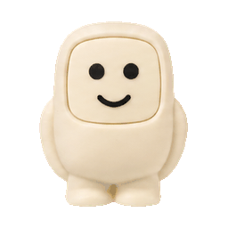 | 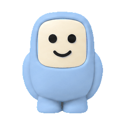 | 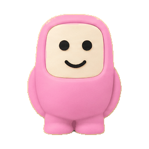 |
| **집중** `focus` | 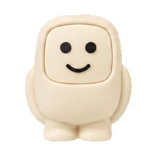 | 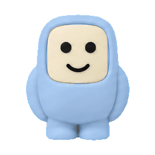 | 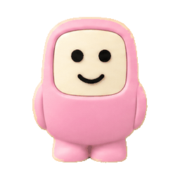 |
| **걷기** `walk` | 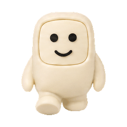 | 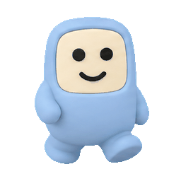 | 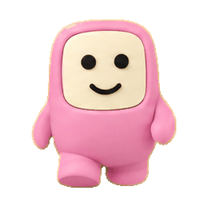 |
| **성취** `success` | 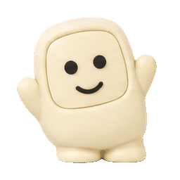 | 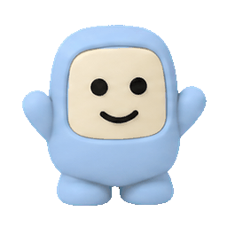 | 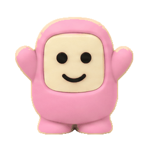 |

- **idle** 잔잔한 숨쉬기 + 웃음 · **focus** 눈 감고 집중 · **walk** 걷기 루프 · **success** 만세 축하

## 코어 감정 · Core emotions

| 상태 | Cream | Blue | Pink |
|:--|:--:|:--:|:--:|
| **기쁨** `joy` | 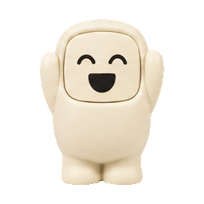 | 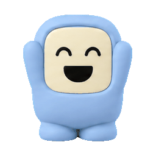 | 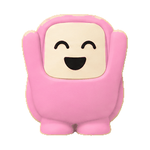 |
| **슬픔** `sad` | 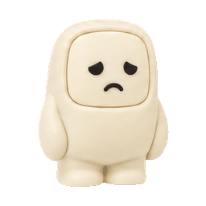 | 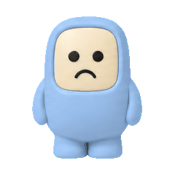 | 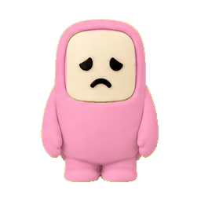 |
| **놀람** `surprise` | 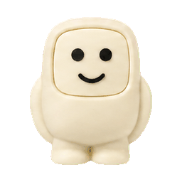 | 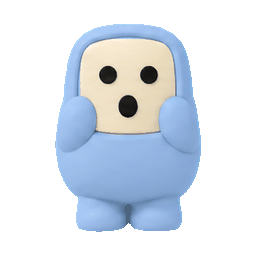 | 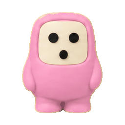 |
| **격려** `encouraging` | 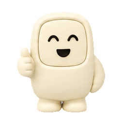 | 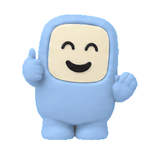 | 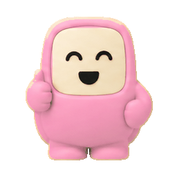 |
| **경고** `alert` | 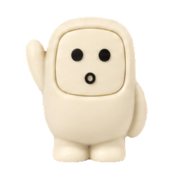 | 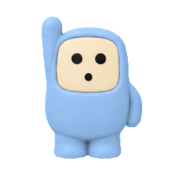 | 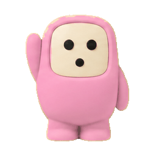 |

## 확장 감정 · Extended emotions

| 상태 | Cream | Blue | Pink |
|:--|:--:|:--:|:--:|
| **평온** `relaxed` | 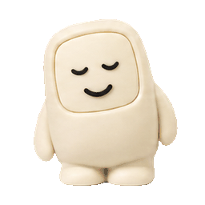 | 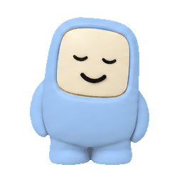 | 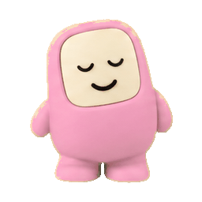 |
| **기대** `anticipation` | 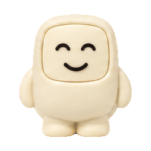 | 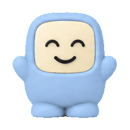 | 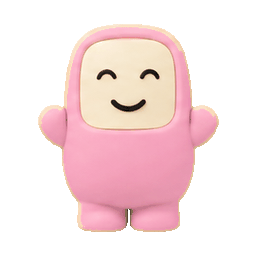 |
| **걱정** `anxious` | 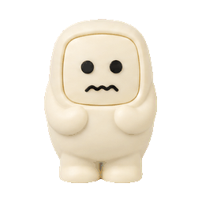 | 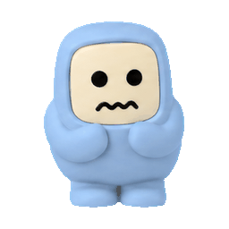 | 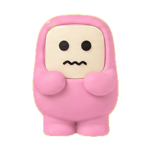 |
| **분노** `angry` | 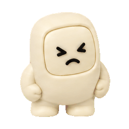 | 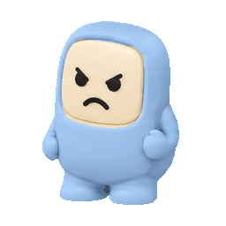 | 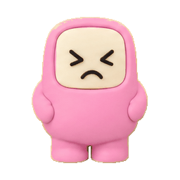 |
| **졸림** `sleepy` | 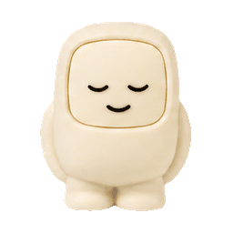 | 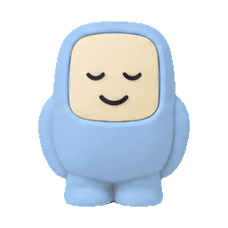 | 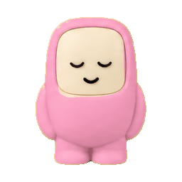 |
| **지루함** `bored` | 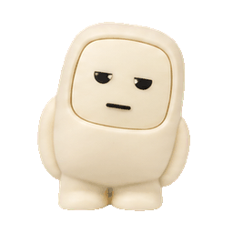 | 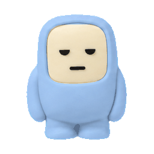 | 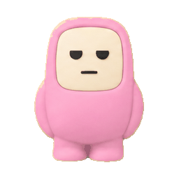 |
| **사랑** `love` | 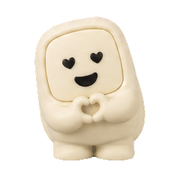 | 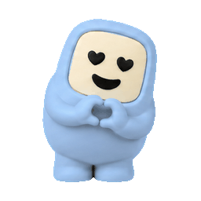 | 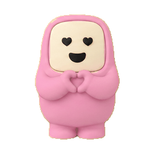 |
| **결심** `determined` | 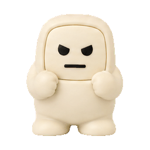 | 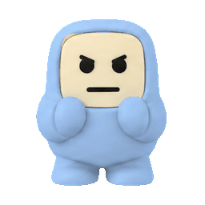 |  |

## 보조 감정 · More expressions

| 상태 | Cream | Blue | Pink |
|:--|:--:|:--:|:--:|
| **의심** `thinking` |  |  |  |
| **혐오** `disgust` |  |  |  |
| **부끄러움** `shy` |  |  |  |
| **산만** `distracted` |  |  |  |

---

## 롱 idle · Long idle loops

세그먼트 분할 생성(숨쉬기·웃음·깜빡, 각 8프레임 · 중립 포즈로 시작/종료) 후 이어붙인 긴 idle 루프입니다.
Long idle loops stitched from separately generated segments (breath · smile · blink), each anchored to the same neutral pose.

| 버전 | Cream | Blue | Pink |
|:--|:--:|:--:|:--:|
| **D** raw 스티치 · 4초 (실제 24프레임) |  |  |  |
| **E** 세그+모션보간 · 8초 |  |  |  |
| **F** 시퀀스 연출 · 9.5초 (숨쉬다 가끔 웃고 깜빡) |  |  |  |

---

## Sprite sheets

`spritesheets/<color>/` 에 실사용 에셋이 들어 있습니다.

```
spritesheets/<color>/
├── sprite-sheet-alpha.png   # 투명 배경 아톰라스 (21상태)
├── manifest.json            # 런타임 좌표 (frame_layout · fps · loop)
└── frames/<state>/*.png     # 상태별 개별 프레임
```

런타임 코드는 `manifest.json` 의 `frame_layout` 사각형만 샘플링하면 됩니다.

---

## License

© 2026 Dcode Labs. All rights reserved.

"logi focus" 및 logi focus 마스코트 캐릭터와 이 저장소의 모든 아트워크·애니메이션·스프라이트
에셋은 Dcode Labs 의 자산입니다. 본 에셋은 **쇼케이스·참고 목적으로만** 공개되며,
사전 서면 허가 없이 사용·복제·수정·배포·2차적저작물 제작을 허가하지 않습니다.

These assets are published for showcase and reference only. No license is granted to use,
reproduce, modify, or distribute them without prior written permission.

문의 · Inquiries: **support@1pass.dev**
